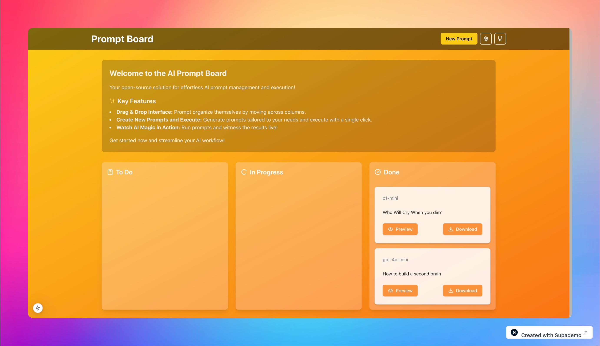

# PromptBoard



## Overview
**PromptBoard** is an open-source AI prompt management system that provides a streamlined interface for creating, organizing, and executing AI prompts. Built with Next.js and integrated with OpenAI's API, this platform offers a modern, drag-and-drop interface for managing your AI workflows efficiently.

## Key Features
- **Kanban-Style Board**: Organize prompts across different stages:
  - **To Do**: Create and store prompts for later use
  - **In Progress**: Track currently executing prompts
  - **Done**: Review completed prompt results
  
- **Prompt Management**:
  - **BYOK: Bring your Own Keys (BYOK) - API keys, Data is not stored on server side, everything is in client side localStorage.
  - **Create Prompts**: Easily create new prompts with custom parameters
  - **Execute Prompts**: Run prompts directly through OpenAI's API
  - **Preview Results**: View results in a formatted markdown preview
  - **Download Results**: Export prompt results as markdown files


## Quick Deployment on Vercel
Deploying **Prompt Board** is simple and fast with Vercel's one-click deployment option. Vercel provides a powerful and scalable environment for your project.

[](https://vercel.com/new/clone?repository-url=https://github.com/justmalhar/promptboard)

  
- **Modern Tech Stack**:
  - **Next.js 15** with React 19 for a powerful, modern frontend
  - **TypeScript** for type-safe development
  - **Tailwind CSS** for responsive, utility-first styling
  - **@hello-pangea/dnd** for smooth drag-and-drop functionality
  - **OpenAI Integration** for executing prompts
  - **React Markdown** for rendering prompt results

## Quick Start

### Prerequisites
- Node.js (Latest LTS version recommended)
- OpenAI API key

### Installation
```bash
# Clone the repository
git clone https://github.com/yourusername/promptboard.git

# Navigate to the project directory
cd promptboard

# Install dependencies
npm install

# Create a .env file and add your OpenAI API key
# You can also add this later through the UI settings
echo "OPENAI_API_KEY=your_api_key_here" > .env.local

# Start the development server
npm run dev
```

Visit `http://localhost:3000` to see the application running.

## Development Commands
| Command | Description |
|---------|-------------|
| `npm run dev` | Start development server |
| `npm run build` | Create production build |
| `npm run start` | Start production server |
| `npm run lint` | Run ESLint for code quality |

## Detailed Tech Stack
| Technology | Version | Purpose |
|------------|---------|----------|
| Next.js | 15.0.3 | React framework |
| React | 19.0.0-rc | UI library |
| TypeScript | ^5 | Type safety |
| Tailwind CSS | ^3.4.1 | Styling |
| @hello-pangea/dnd | ^17.0.0 | Drag and drop |
| OpenAI | ^4.71.1 | AI integration |
| React Markdown | ^9.0.1 | Markdown rendering |

## Contributing
We welcome contributions! Here's how you can help:

1. Fork the repository
2. Create a feature branch (`git checkout -b feature/AmazingFeature`)
3. Commit your changes (`git commit -m 'Add some AmazingFeature'`)
4. Push to the branch (`git push origin feature/AmazingFeature`)
5. Open a Pull Request

## License
This project is licensed under the MIT License - see the [LICENSE](LICENSE) file for details.

## Acknowledgments
- Built with [Next.js](https://nextjs.org/)
- Styled with [Tailwind CSS](https://tailwindcss.com/)
- Icons from [Lucide React](https://lucide.dev/)
- Drag and Drop powered by [@hello-pangea/dnd](https://github.com/hello-pangea/dnd)

---

## Stay Connected
- **Twitter/X**: [@justmalhar](https://twitter.com/justmalhar) 🛠
- **LinkedIn**: [Malhar](https://linkedin.com/in/justmalhar) 💻

Made with ❤️ and AI by [@justmalhar](https://twitter.com/justmalhar)